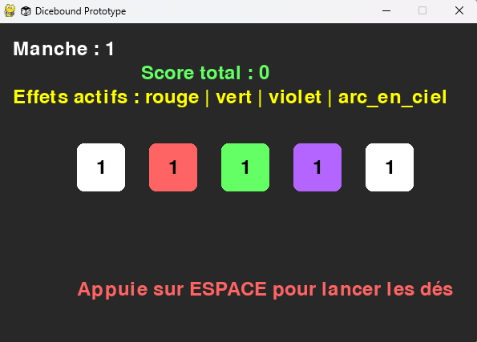

# 🎲 DICEBOUND

**Prototype de jeu Python inspiré du Yams et du Roguelike**  
**Technologies : Python | Pygame | VSCode**  
**Licence : MIT / libre**

---

## 🧩 À propos du projet

**Dicebound** est un prototype développé en Python avec Pygame, inspiré du **Yams** et des mécaniques **roguelike**.  
Le joueur lance plusieurs dés aux propriétés uniques (valeur, couleur, bonus…) et doit composer avec le hasard pour obtenir le meilleur score possible.

Ce projet est un exercice d’apprentissage pratique, axé sur la **structure d’un moteur de jeu**, la **logique événementielle** et la **programmation orientée objet**.

---

## 🧠 Objectifs d’apprentissage

Ce projet a été réalisé dans le cadre de l’apprentissage du développement Python.  
L’IA (ChatGPT) a servi d’**assistant pédagogique**, chaque portion de code a été comprise, testée et ajustée manuellement.

**Compétences mises en pratique :**
- Structure modulaire (`main.py`, `dice.py`)
- Programmation orientée objet (`classe Die`)
- Gestion d’une boucle de jeu avec Pygame
- Capture d’événements clavier et souris
- Affichage graphique des dés et textes
- Débogage et itérations d’apprentissage

---

## 🕹️ Fonctionnalités actuelles

| Fonction | Description |
|----------|-------------|
| 🎲 Lancer les dés | Appuie sur Espace pour lancer les 5 dés |
| 📊 Calcul du score | Le total s’affiche dynamiquement à l’écran |
| 💰 Gestion de l’argent | Le score est converti en argent et cumulé |
| 🧱 Interface graphique | Affichage des dés et textes avec Pygame |
| 🧩 Architecture claire | Code séparé entre logique (`dice.py`) et exécution (`main.py`) |
| 🖱️ Interaction à la souris | Cliquer sur un dé pour le garder ou relancer |

---

### 🎲 Dés spéciaux et effets

- 🔴 Rouge → multiplicateur ×2  
- 🔵 Bleu → bonus +50 points  
- 🟡 Doré → jackpot aléatoire (+100 à +200)  
- 🟢 Vert → garde automatique  
- 🟣 Violet → double la valeur du **prochain lancer**  
- ⚫ Noir → relance un autre dé aléatoire  
- 🌈 Arc-en-ciel → jackpot aléatoire très élevé  

---

## 🧰 Stack technique

| Technologie | Description |
|------------|-------------|
| 🐍 Python 3.11 | Langage principal |
| 🎮 Pygame 2.6 | Moteur 2D et gestion des événements |
| 🧠 IA (ChatGPT) | Support pédagogique et assistance technique |
| 🖥️ Visual Studio Code | Environnement de développement |
| 🪟 Windows 11 | Système utilisé |

---

## 🚀 Améliorations prévues

- 🎨 Dés de couleur avec multiplicateurs  
- 💰 Jackpot et systèmes de bonus  
- 🔊 Effets visuels et sonores  
- 🏁 Écran de menu et progression type roguelike  
- 📈 Amélioration de la stratégie et de l’interaction joueur  

---

## 💬 À propos de l’auteur

**Maxence Labrune**  
Apprenant développeur Python / Game Dev débutant  

📧 `Maxencelabrune@outlook.fr`  
🌐  

> “Je considère ce prototype comme mon premier pas concret dans le développement de jeux vidéo.  
> Il m’a appris à comprendre le code, pas seulement à le reproduire.”

---

⭐ Si le projet t’intéresse, n’hésite pas à **le forker** ou à lui **laisser une étoile** !  

